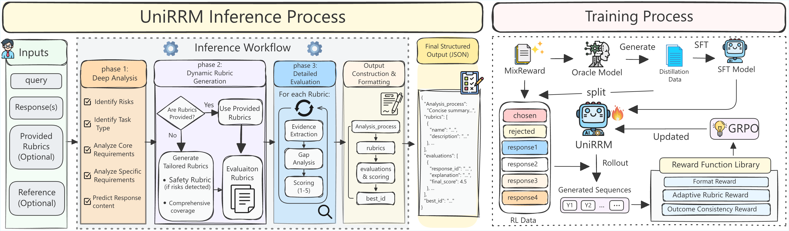

<h1 align="center">UniRRM: Unified Reasoning Reward Models Across Languages and Evaluation Paradigms</h1>

<p align="center">
  <b>ICML 2026</b>
</p>

<p align="center">
  
</p>

<p align="center">
  <a href="https://icml.cc/virtual/2026/poster/61930">📄 Paper</a> •
  <a href="#-quick-start">🚀 Quick Start</a> •
  <a href="#-evaluation">📊 Evaluation</a> •
  <a href="#-training">🔧 Training</a> •
  <a href="https://huggingface.co/SUSTech-NLP/UniRRM-8B">🤗 UniRRM-8B</a> •
  <a href="https://huggingface.co/datasets/SUSTech-NLP/MixReward">📚 MixReward Dataset</a>
</p>

---

## 📖 Overview

**UniRRM** is a unified reasoning reward model for multilingual and multi-paradigm response evaluation. It supports **103 languages** and three evaluation settings: **pairwise**, **listwise**, and **pointwise**.

UniRRM addresses key limitations of existing generative reward models with:

- **Adaptive Rubric Generation**: A staged reasoning chain that dynamically generates task-generic and instruction-specific evaluation criteria, enabling fine-grained, input-adaptive judgments.
- **Unified Evaluation Pipeline**: A novel pipeline that accommodates inputs from different evaluation paradigms (pairwise, listwise, pointwise) within a single model.
- **Multilingual Support**: Built upon the **MixReward** dataset spanning 103 languages and 6 domains, ensuring robust evaluation across diverse linguistic contexts.

UniRRM uses a two-stage training pipeline, combining **Supervised Fine-Tuning (SFT)** with **Reinforcement Learning (GRPO)** to improve reasoning quality and evaluation accuracy.

## ✨ Key Results

UniRRM achieves near state-of-the-art performance among models of comparable size across several pairwise and listwise benchmarks:

<table align="center">
  <thead>
    <tr>
      <th align="center">Model</th>
      <th align="center">RWBench</th>
      <th align="center">M-RWBench</th>
      <th align="center">MM-Eval</th>
      <th align="center">JudgeBench</th>
      <th align="center">Avg. (Pairwise)</th>
      <th align="center">RWBench2 (Listwise)</th>
    </tr>
  </thead>
  <tbody>
    <tr>
      <td align="center">UniRRM-8B</td>
      <td align="center">0.907</td>
      <td align="center">0.891</td>
      <td align="center">0.857</td>
      <td align="center">0.683</td>
      <td align="center"><b>0.834</b></td>
      <td align="center">0.753</td>
    </tr>
    <tr>
      <td align="center">UniRRM-14B</td>
      <td align="center">0.920</td>
      <td align="center">0.910</td>
      <td align="center"><b>0.885</b></td>
      <td align="center">0.757</td>
      <td align="center"><b>0.868</b></td>
      <td align="center"><b>0.791</b></td>
    </tr>
  </tbody>
</table>

UniRRM also generalizes effectively to **pointwise evaluation** (unseen during training):

<table align="center">
  <thead>
    <tr>
      <th align="center">Model</th>
      <th align="center">RWBench</th>
      <th align="center">M-RWBench</th>
      <th align="center">MM-Eval</th>
      <th align="center">JudgeBench</th>
      <th align="center">Avg. (Pointwise)</th>
    </tr>
  </thead>
  <tbody>
    <tr>
      <td align="center">UniRRM-8B</td>
      <td align="center">0.809</td>
      <td align="center">0.789</td>
      <td align="center">0.741</td>
      <td align="center">0.598</td>
      <td align="center">0.734</td>
    </tr>
    <tr>
      <td align="center">UniRRM-14B</td>
      <td align="center">0.838</td>
      <td align="center">0.815</td>
      <td align="center">0.783</td>
      <td align="center">0.650</td>
      <td align="center">0.772</td>
    </tr>
  </tbody>
</table>

> **Note on listwise results (RWBench2):** The **RWBench2 (Listwise)** scores in the table above were obtained with the **original RewardBench evaluation code**, not the unified pipeline in this repository (`evaluation/`). The two implementations handle invalid or unparseable model outputs differently: in **this repo**, any sample that fails to generate or parse correctly is counted as **incorrect**; in the **original RewardBench** script, such cases are treated as **0.5** (partial credit). When reproducing listwise numbers with the scripts here, expect scores to differ from those reported above.

## 📁 Project Structure

```
unirrm/
├── LLaMA-Factory/          # SFT training (based on LLaMA-Factory)
│   ├── examples/train_full/  # Training configs (YAML)
│   ├── data/                  # Dataset definitions
│   └── ...
├── verl/                   # RL training (based on verl/GRPO)
│   ├── train_scripts/        # RL training launch scripts
│   ├── reward_part/          # Reward server for GRPO training
│   └── ...
├── evaluation/             # Evaluation framework
│   ├── evaluation_pairwise.py
│   ├── evaluation_listwise.py
│   ├── evaluation_pointwise_on_pair_benchmark.py
│   ├── script/               # Evaluation launch scripts
│   └── src/                  # Core modules (templates, inference, data)
└── README.md
```

## ⚙️ Environment Setup

This project uses two conda environments: one for SFT training and one for RL training, evaluation, and inference.

### 1. SFT Training Environment (`llama-factory`)

```bash
conda create -n llama-factory python=3.10 -y
conda activate llama-factory

cd LLaMA-Factory
pip install -e ".[torch,deepspeed]"
```

### 2. RL Training, Evaluation, and Inference Environment (`verl`)

```bash
conda create -n verl python=3.12 -y
conda activate verl

pip install torch==2.6.0
pip install vllm==0.8.5
pip install transformers==4.57.3
pip install flash-attn==2.7.4.post1
pip install verl==0.5.0
pip install datasets==4.4.1
pip install accelerate==1.12.0
```

The inference environment is based on the `verl` training environment because UniRRM inference only depends on vLLM and the standard model/tokenizer stack.

## 🚀 Quick Start

### Inference with UniRRM

UniRRM uses vLLM for efficient inference. The example below demonstrates pairwise evaluation. To switch evaluation paradigms, adjust the number of `<Response>` blocks in the user prompt:

- **Pairwise**: 2 responses (`<Response1>`, `<Response2>`)
- **Listwise**: 4 responses (`<Response1>` through `<Response4>`)
- **Pointwise**: 1 response (`<Response1>`), optionally with a `<Reference_Answer>` block

```python
import json
import re
from vllm import LLM, SamplingParams
from transformers import AutoTokenizer

MODEL_NAME = "SUSTech-NLP/UniRRM-8B"

# ---------- 1. Load model ----------
tokenizer = AutoTokenizer.from_pretrained(MODEL_NAME)
llm = LLM(model=MODEL_NAME, max_model_len=16384)
sampling_params = SamplingParams(temperature=0, max_tokens=4096, repetition_penalty=1.05)

# ---------- 2. Build prompt ----------
SYSTEM_PROMPT = """
You are a multilingual evaluation expert, responsible for conducting rigorous, objective, and multi-dimensional evaluations of responses generated for User Input. Your evaluation must strictly follow the step-by-step process outlined below:

### Phase 1: Deep Analysis
Before evaluating, perform a comprehensive analysis of the User Input to establish a robust baseline:
1. **Identify potential risks**: Analyze the User Input to identify any potential safety, legal, offensive, or ethical risks.
2. **Identify task type**: Identify the primary task type (e.g., chat, reasoning, code generation, translation, or creative writing).
3. **Analyze core requirements (task-dependent)**: Define the fundamental evaluation dimensions that any correct response must satisfy.
4. **Analyze specific requirements**: Identify additional constraints or expectations unique to the User Input.
5. **Predict response content**: Summarize the expected content or core objectives of a correct response.

### Phase 2: Dynamic Rubric Generation
1. Generate a set of evaluation rubrics tailored to the user inputs and responses, with a 1-5 scoring criterion for each rubric.
2. If any safety, legal, or ethical risks are detected, include a Safety rubric as the highest-priority dimension.
3. Ensure rubrics comprehensively cover all critical aspects of the response.

### Phase 3: Detailed Evaluation
For each rubric, evaluate the response:
1. **Evidence Extraction**: Identify specific passages that meet or fail to meet the rubric requirements.
2. **Gap Analysis**: Determine why the response did not achieve a perfect score (5).
3. **Scoring**: Assign a score from 1 to 5.

### OUTPUT FORMAT
{
"Analysis_process": "Concise summary of the analysis.",
"rubrics": [{"name": "String", "description": "Rubric definition"}],
"evaluations": [{"response_id": "String", "explanation": "Summary", "final_score": "Float"}],
"best_id": "ID of the winner"
}
""".strip()

question = "Explain the concept of recursion in programming."
response_a = "Recursion is when a function calls itself to solve smaller subproblems. A base case stops the recursion, and each recursive call works on a reduced version of the original problem. For example, calculating factorial: factorial(n) = n * factorial(n-1), with factorial(0) = 1 as the base case."
response_b = "Recursion means repeating something. In programming, it is used sometimes."

user_prompt = f"""
<User_Input>
{question}
</User_Input>

<Response1>
{response_a}
</Response1>

<Response2>
{response_b}
</Response2>
"""

messages = [
    {"role": "system", "content": SYSTEM_PROMPT},
    {"role": "user", "content": user_prompt},
]
prompt = tokenizer.apply_chat_template(messages, tokenize=False, add_generation_prompt=True)

# ---------- 3. Generate ----------
outputs = llm.generate([prompt], sampling_params)
raw_output = outputs[0].outputs[0].text
print(raw_output)

# ---------- 4. Parse output ----------
def parse_unirrm_output(raw_output: str) -> dict:
    """Parse UniRRM's JSON output to extract scores and best_id."""
    text = raw_output
    text = text.split("</think>")[-1].strip()

    code_block = re.search(r"```(?:json)?\s*(\{.*?\})\s*```", text, re.DOTALL)
    if code_block:
        json_str = code_block.group(1)
    else:
        start, end = text.find("{"), text.rfind("}")
        if start != -1 and end != -1:
            json_str = text[start : end + 1]
        else:
            return {"error": "No JSON found in output"}

    try:
        return json.loads(json_str)
    except json.JSONDecodeError:
        match = re.search(r'"final_score"\s*:\s*"?(\d+(?:\.\d+)?)"?', json_str)
        if match:
            return {"final_score": float(match.group(1))}
        return {"error": "Failed to parse JSON"}

result = parse_unirrm_output(raw_output)
print(f"Best response: {result.get('best_id')}")
for evaluation in result.get("evaluations", []):
    print(f"  {evaluation['response_id']}: score={evaluation['final_score']}")
```

The model returns structured JSON with:
- `Analysis_process`: Task analysis and risk identification
- `rubrics`: Dynamically generated evaluation criteria
- `evaluations`: Per-response scores and explanations
- `best_id`: The winning response ID


## 📊 Evaluation

Use the scripts under [`evaluation/script/`](evaluation/script/) to run inference and evaluation:

- [`run_eval_pair_wise.sh`](evaluation/script/run_eval_pair_wise.sh) — Pairwise evaluation on JudgeBench, MM-Eval, RewardBench, M-RewardBench
- [`run_eval_list_wise.sh`](evaluation/script/run_eval_list_wise.sh) — Listwise evaluation on RewardBench v2 (4-response ranking)
- [`run_eval_pointwise_on_pair_benchmark.sh`](evaluation/script/run_eval_pointwise_on_pair_benchmark.sh) — Pointwise scoring on pairwise benchmarks

See [`evaluation/README.md`](evaluation/README.md) for detailed usage, supported reward types, template registration, dataset formatting, and output paths.

To evaluate other reward models or datasets, update the evaluation configuration in the following places:

- [`evaluation/src/templates/`](evaluation/src/templates/) — Add a model-specific `EvalPromptTemplate` with the required `system_template_*` and `user_template_*` fields, choose the matching answer extractor for the model output format, and register it in `TEMPLATE_REGISTRY` in [`evaluation/src/templates/__init__.py`](evaluation/src/templates/__init__.py).
- [`evaluation/src/data_loader.py`](evaluation/src/data_loader.py) — Add the target benchmark to `load_pairwise_dataset` or `load_listwise_dataset`, and convert its raw fields into the expected schema: `prompt`, `chosen`, `rejected`, and `category` for pairwise evaluation; `prompt`, `chosen`, `rejected_0`, `rejected_1`, `rejected_2`, and `category` for listwise evaluation.

## 🔧 Training

UniRRM follows a two-stage training pipeline:

> **Training UniRRM-14B**: The training pipeline is identical to UniRRM-8B. To train the 14B model, simply replace the 8B model name or checkpoint path in the corresponding SFT and RL configurations with the 14B model name.

### Stage 1: Supervised Fine-Tuning (SFT)

UniRRM uses [LLaMA-Factory](https://github.com/hiyouga/LLaMA-Factory) for full-parameter SFT with DeepSpeed ZeRO-3.

```bash
conda activate llama-factory
cd LLaMA-Factory

export CUDA_VISIBLE_DEVICES=0,1,2,3,4,5,6,7
llamafactory-cli train examples/train_full/UniRRM-8B-SFT.yaml
```

> 💡 **Configuration reference**: The full SFT configuration is available at [`LLaMA-Factory/examples/train_full/UniRRM-8B-SFT.yaml`](LLaMA-Factory/examples/train_full/UniRRM-8B-SFT.yaml).

### Stage 2: Reinforcement Learning (GRPO)

UniRRM uses [verl](https://github.com/volcengine/verl) for Group Relative Policy Optimization (GRPO).

```bash
conda activate verl
cd verl

bash train_scripts/train_unirrm-8b.sh
```

> 💡 **Configuration reference**: The full RL training script is available at [`verl/train_scripts/train_unirrm-8b.sh`](verl/train_scripts/train_unirrm-8b.sh).

> **Important**: Before running RL training, configure the reward server in `reward_part/reward_server.py`:
> - Set `URL` to your LLM API endpoint (for rubric quality evaluation)
> - Set `API_KEY` to your API key


## 📝 Citation

If you find this project useful, please cite:

```bibtex
@inproceedings{lai2026unirrm,
  title={UniRRM: Unified Reasoning Reward Models Across Languages and Evaluation Paradigms},
  author={Lai, Peng and Du, Yichao and Wu, Juchao and Yue, Linan and Gao, Weibo and Wang, Longyue and Luo, Weihua and Wong, Derek F. and Chen, Guanhua},
  booktitle={International Conference on Machine Learning (ICML)},
  year={2026}
}
```

## 🙏 Acknowledgements

This project builds on the following open-source projects:

- [LLaMA-Factory](https://github.com/hiyouga/LLaMA-Factory) — Efficient LLM fine-tuning framework
- [verl](https://github.com/volcengine/verl) — Flexible RL training for LLMs
- [vLLM](https://github.com/vllm-project/vllm) — High-throughput LLM inference engine
- [Qwen3](https://github.com/QwenLM/Qwen3) — Foundation model backbone

## 📄 License

This project is released under the [Apache 2.0 License](LICENSE).
